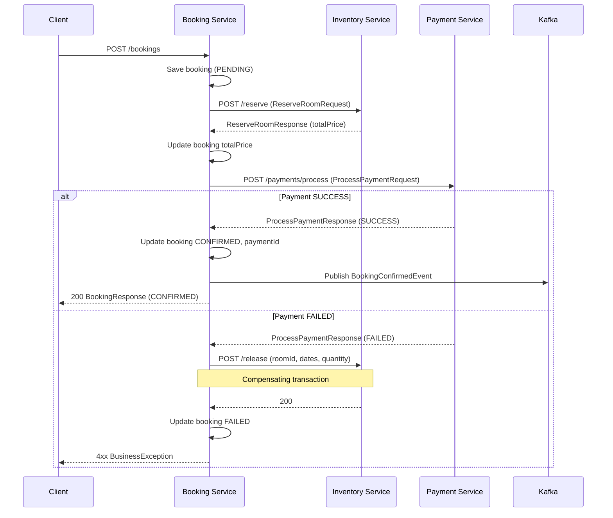
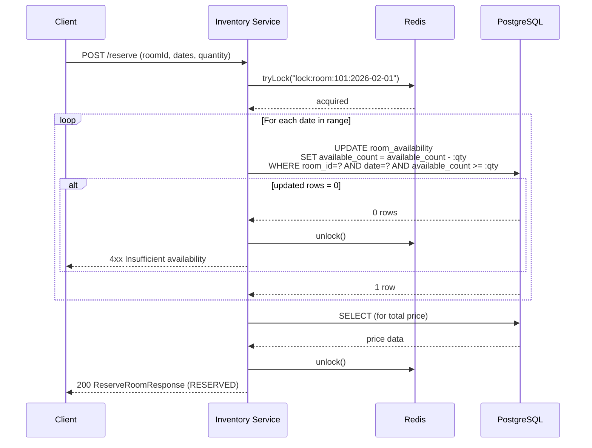
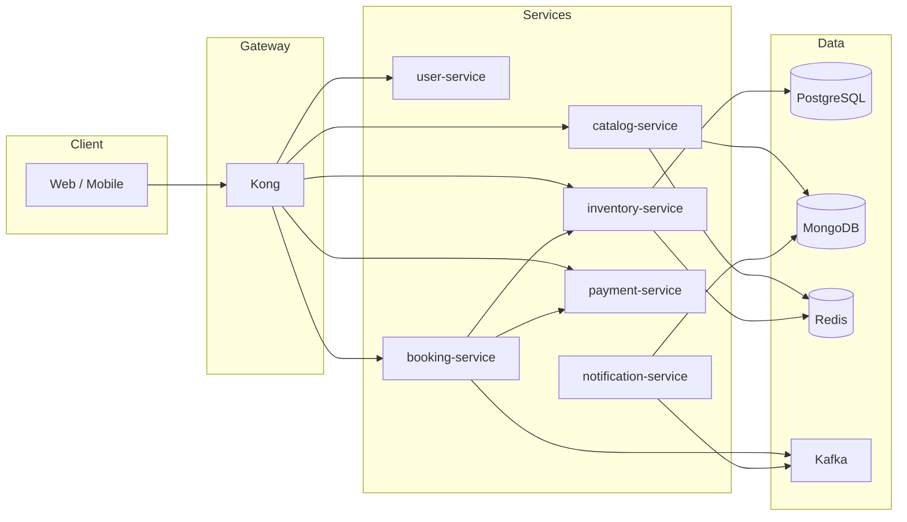
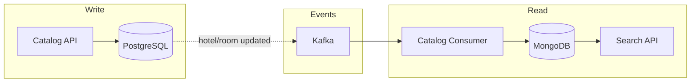

# OpenBooking – Architecture Diagrams

Các sơ đồ dưới đây dùng cho mô tả kiến trúc khi phỏng vấn hoặc onboard.

---

## 1. Booking Saga (Orchestration)

Flow đặt phòng: Booking Service làm orchestrator, gọi Inventory → Payment → Confirm. Nếu payment fail thì chạy compensating transaction (release room).

---

## 2. Inventory – Distributed Lock + DB Atomic Update

Chiến lược `distributed`: Redis lock theo key `lock:room:{roomId}:{date}`, bên trong critical section chỉ gọi một câu UPDATE xuống DB (atomic), không đọc entity lên Java rồi trừ (tránh race condition).

---

## 3. High-level Microservices

Vị trí các service và luồng chính: Client → Gateway → Services → DBs / Kafka.

---

## 4. CQRS (Catalog – Write vs Read)

Ghi vào PostgreSQL (write model), đồng bộ sang MongoDB (read model) qua event hoặc batch để search nhanh.

---

Có thể copy các block Mermaid vào README hoặc dùng công cụ render (GitHub, GitLab, VS Code Mermaid extension) để xem diagram.
